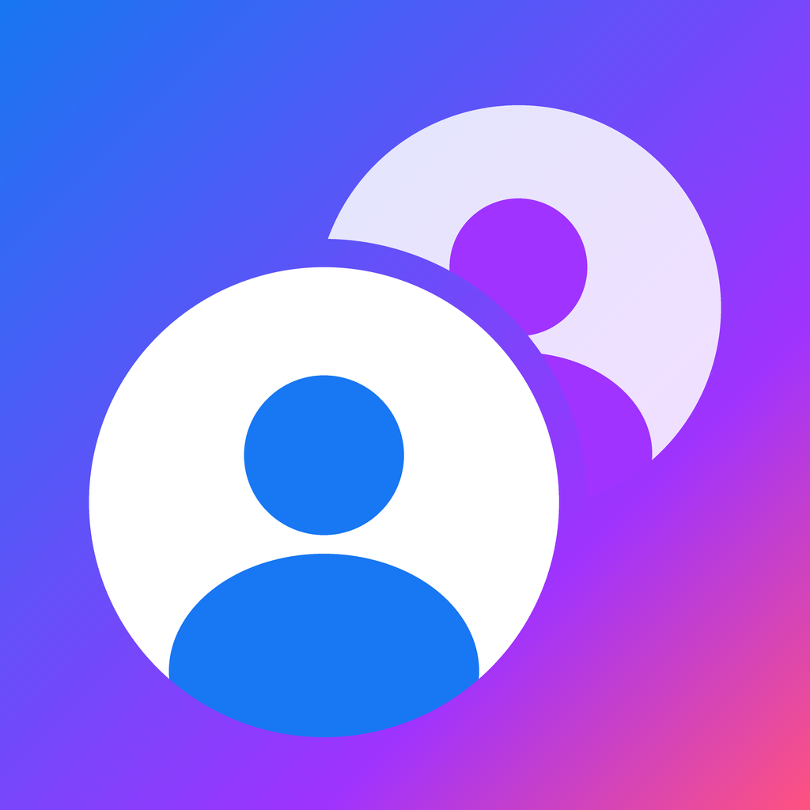

# DuoSocial — 2 Facebook + 2 Messenger trên một iPhone

Ứng dụng iOS (SwiftUI) cho phép **đăng nhập cùng lúc 2 tài khoản Facebook và 2 tài khoản Messenger**
(hoặc nhiều hơn) và chuyển qua lại chỉ bằng một chạm, không phải đăng xuất/đăng nhập lại.

Mỗi tài khoản hiển thị **chính trang facebook.com / messenger.com** nên giao diện, tính năng
(bảng tin, bình luận, story, nhóm, nhắn tin, gọi thoại/video, gửi ảnh…) giống hệt bản web của Facebook.

<p align="center"></p>

## Tính năng

| | |
|---|---|
| 👥 **Nhiều tài khoản song song** | Mặc định có 4 ô: Facebook 1, Facebook 2, Messenger 1, Messenger 2. Thêm/xóa tùy ý. |
| 🔒 **Phiên đăng nhập tách biệt** | Mỗi tài khoản có kho cookie/bộ nhớ riêng (`WKWebsiteDataStore(forIdentifier:)`), đăng nhập được lưu lại sau khi tắt app. |
| 🔗 **Dùng chung phiên (tùy chọn)** | Cho Messenger 1 dùng luôn đăng nhập của Facebook 1 để khỏi đăng nhập hai lần. |
| ⚡ **Chuyển tài khoản tức thì** | Ảnh đại diện các tài khoản ở góc trên như nút chuyển trang cá nhân của Facebook; các trang được giữ trong bộ nhớ nên không phải tải lại. |
| 📱 **Tab bar như app Facebook** | Trang chủ · Video · Bạn bè · Marketplace · Thông báo · Menu, tự tô sáng theo trang đang xem và ẩn khi đang gõ phím. |
| 🔴 **Số chưa đọc** | Đọc từ tiêu đề trang (vd. `(3) Facebook`) và hiện huy hiệu đỏ trên từng tài khoản. |
| 🔔 **Thông báo, kể cả khi chạy nền** | Báo khi một tài khoản có thêm tin/thông báo chưa đọc, cập nhật số trên biểu tượng app. Khi app ở nền, iOS thỉnh thoảng đánh thức app để kiểm tra tin mới. |
| 🛡️ **Khóa bằng Face ID / Touch ID** | Che toàn bộ nội dung (kể cả trong màn hình đa nhiệm). |
| 📞 **Gọi thoại/video, gửi ảnh, tải tệp** | Cấp quyền camera/micro, mở cửa sổ gọi, lưu/chia sẻ tệp đính kèm. |
| 🌐 **Link ngoài mở trong trình duyệt** | Tự bỏ trang chuyển hướng `l.facebook.com`, chặn trang web tự đẩy sang app Facebook/Messenger chính thức. |
| 🖥️ **Chọn giao diện** | Di động / Máy tính / Máy tính vừa màn hình — cho từng tài khoản. |

### Thao tác nhanh

- **Chạm ảnh đại diện** ở góc trên để chuyển sang tài khoản đó.
- **Chạm tên tài khoản đang mở** (góc trên bên trái): danh sách tài khoản, Về trang chủ · Tải lại · Chỉnh sửa · Đăng xuất.
- **Nhấn giữ ảnh đại diện** của tài khoản khác: các thao tác tương tự cho tài khoản đó.
- **Chạm lại tab đang mở**: cuộn lên đầu; chạm lần nữa: tải lại.
- **Vuốt từ mép trái** để quay lại trang trước; **kéo xuống** để tải lại (Facebook).
- Nút **⚙︎** (góc trên bên phải): quản lý tài khoản, khóa Face ID, thông báo, kiểm tra tin khi chạy nền.

Tài khoản Messenger không có tab bar dưới cùng vì trang Messenger đã có thanh điều hướng riêng — để dành chỗ cho cuộc trò chuyện.

## Cài đặt

Yêu cầu: **iOS 17 trở lên** (API kho dữ liệu web tách biệt chỉ có từ iOS 17).

### Cách 1 — Có máy Mac + Xcode 16 trở lên

**Nhanh nhất — một lệnh:**

1. Cài Xcode từ App Store, mở Xcode một lần, vào **Xcode → Settings… → Accounts** và đăng nhập Apple ID.
2. Cắm iPhone vào Mac, mở khóa và chọn **Tin cậy máy tính này**.
3. Mở Terminal và chạy:

   ```bash
   git clone -b claude/ios-multi-account-facebook-messenger-7tz44p https://github.com/quocmanhwork-eng/appfacebook.git
   cd appfacebook
   ./scripts/install-on-iphone.sh
   ```

   Script tự tìm Team ID, đặt Bundle ID riêng (`com.<tên-user-mac>.duosocial`), build, cài và mở app.
   Nếu iOS chưa cho mở app, làm bước 4 bên dưới rồi mở DuoSocial trên màn hình chính.

**Hoặc làm thủ công trong Xcode:**

1. Mở `DuoSocial.xcodeproj` bằng Xcode.
2. Chọn target **DuoSocial** → tab **Signing & Capabilities**:
   - **Team**: chọn Apple ID của bạn (tài khoản miễn phí cũng được).
   - **Bundle Identifier**: đổi thành một mã duy nhất, vd. `com.tenban.duosocial`.
3. Cắm iPhone, chọn iPhone làm đích chạy rồi bấm **Run** (⌘R).
4. Lần đầu: trên iPhone vào **Cài đặt → Cài đặt chung → Quản lý VPN & thiết bị** → tin cậy nhà phát triển.
   Với iOS 16+ cần bật **Cài đặt → Quyền riêng tư & Bảo mật → Chế độ nhà phát triển**.

> Với Apple ID miễn phí, ứng dụng hết hạn sau 7 ngày — chỉ cần bấm Run lại. Tài khoản Apple Developer trả phí thì được 1 năm.

### Cách 2 — Không có Mac (Windows)

Mỗi lần đẩy code, GitHub Actions tự build một file **`DuoSocial-unsigned.ipa`**:

1. Vào tab **Actions** của repo → chọn lần chạy **iOS** mới nhất (màu xanh) → tải artifact **DuoSocial-unsigned-ipa**.
2. Giải nén để lấy file `.ipa`, rồi cài bằng **Sideloadly** hoặc **AltStore** (các công cụ này tự ký lại bằng Apple ID của bạn).

## Cách hoạt động

```
DuoSocial/
├── App/            DuoSocialApp (điểm vào), AppModel (trạng thái gốc, điều phối)
├── Models/         Account, AccountStore (lưu danh sách tài khoản), AppSettings
├── Web/            WebSession (web view của một tài khoản), WebSessionManager (kho phiên),
│                   BrowserController (link, popup, tải tệp, quyền), LinkPolicy, UnreadParser,
│                   PopupController, Presenter, WebViewFactory (User-Agent, script)
├── Services/       AppLock (Face ID), UnreadNotifier (thông báo, số trên biểu tượng),
│                   UnreadBaseline (chống báo trùng), BackgroundRefresh (kiểm tra khi chạy nền)
└── Views/          RootView, AccountHeader (chuyển tài khoản), PageTabBar (tab kiểu Facebook),
                    SettingsView, AccountEditView…
DuoSocialTests/     Unit test cho LinkPolicy, UnreadParser, PageTab, UnreadBaseline, Account, AccountStore
```

- **Tách phiên đăng nhập**: mỗi `Account` có một `sessionID` (UUID). Web view của tài khoản dùng
  `WKWebsiteDataStore(forIdentifier: sessionID)` — một kho cookie/localStorage/bộ nhớ đệm bền vững
  và độc lập. Hai tài khoản cùng `sessionID` sẽ dùng chung đăng nhập.
- **Giữ web view sống**: mọi tài khoản đã mở nằm trong một `ZStack` (chỉ ẩn đi), nên chuyển tài khoản
  không mất trang đang xem và các tài khoản ẩn vẫn cập nhật số chưa đọc.
- **Nhận diện như Safari**: web view gắn `Version/xx Mobile/15E148 Safari/604.1` vào User-Agent để
  Facebook phục vụ bản web di động đầy đủ. Messenger mặc định dùng giao diện máy tính "vừa màn hình"
  vì bản web di động của Messenger thường bắt cài app.
- **Trạng thái đăng nhập**: kiểm tra cookie `c_user` (ID người dùng Facebook) trong kho của phiên.
- **Chống báo trùng**: số chưa đọc "đã biết" của từng tài khoản được lưu lại; chỉ báo khi số tăng. Khi trang
  đang tải lại, tiêu đề tạm về 0 nên các lần giảm trong lúc đó bị bỏ qua.

## Giới hạn cần biết

- Đây **không phải ứng dụng chính thức của Meta** và không dùng API riêng của Facebook — nó hiển thị
  trang web thật của Facebook. Mật khẩu chỉ được nhập vào trang của Facebook, ứng dụng không lưu lại.
- **Thông báo khi chạy nền đến chậm**: chỉ app chính thức của Meta mới nhận được thông báo đẩy tức thì.
  DuoSocial dùng "Làm mới ứng dụng trong nền" — iOS tự quyết định khi nào đánh thức app (thường vài chục
  phút tới vài giờ một lần, tùy thói quen dùng máy; không chạy nếu bạn vuốt tắt app hoặc bật Chế độ nguồn điện thấp).
  Mỗi lần được đánh thức, app tải lại các tài khoản trong ~20 giây để đọc số chưa đọc. Muốn nhận tin tức thì,
  hãy dùng app Facebook/Messenger chính thức cho tài khoản chính và DuoSocial cho các tài khoản phụ.
- Số chưa đọc dựa vào tiêu đề trang nên phụ thuộc cách Facebook đặt tiêu đề; có thể không hiện ở một số trang.
- Facebook có thể thay đổi giao diện web hoặc yêu cầu xác minh (checkpoint) khi đăng nhập ở thiết bị mới — làm theo hướng dẫn trên trang.
- "Mở sẵn tất cả tài khoản" tốn thêm bộ nhớ; tắt đi trong Menu nếu máy yếu.

## Phát triển

```bash
# Chạy unit test (cần macOS + Xcode 16+)
xcodebuild test -project DuoSocial.xcodeproj -scheme DuoSocial \
  -destination 'platform=iOS Simulator,name=iPhone 16' CODE_SIGNING_ALLOWED=NO

# Vẽ lại biểu tượng app
pip install pillow numpy && python3 scripts/make_app_icon.py
```
